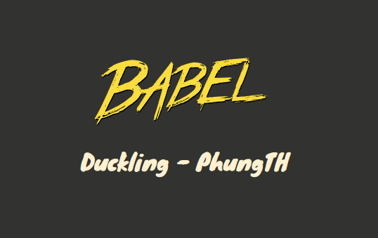

# Babel.js

A Demonstration for Babel + Browserslist + Webpack -->
[Presentation](https://www.canva.com/design/DAGEEJ7Fe5o/zm5a5v2-ESxeFf_QC84SiA/edit?utm_content=DAGEEJ7Fe5o&utm_campaign=designshare&utm_medium=link2&utm_source=sharebutton)



## Introduction

Babel is a JavaScript compiler that allows developers to write code using the latest ECMAScript features and transform it into compatible code that can run on older browsers. In this presentation, we'll explore the importance of Babel in modern web development and how it addresses compatibility issues, particularly with older browsers like Internet Explorer 11.

---

## **1. White screen problem in IE11**

- **Introduction:** Internet Explorer 11, though outdated, still has a significant user base. However, it lacks support for modern JavaScript syntax, leading to compatibility issues.
  
- **Issue:** When modern JavaScript code is executed in IE11, it can result in a "white screen" problem, where the browser fails to render anything due to syntax errors.

---

## **2. What is Babel?**

- **Introduction:** Babel is a JavaScript compiler that allows developers to write code using the latest ECMAScript features and transform it into compatible code that can run on older browsers.

---

## **3. Why do we need Babel?**

- **Importance of Compatibility:** It's crucial for web developers to ensure their applications work across different browsers, including older versions like IE11.

- **Enabling Modern JavaScript:** Babel enables developers to leverage the latest JavaScript features without worrying about compatibility issues.

---

## **4. Babel Packages**

- **@babel/cli:** The command-line interface for Babel, allowing developers to run Babel from the terminal.

  ```shell
  npx babel script.js --out-file script-compiled.js
  ```

- **@babel/core:** The core package of Babel, responsible for parsing, transforming, and generating JavaScript code.

- **@babel/preset-env:** @babel/preset-env is a smart preset that allows you to use the latest JavaScript without needing to micromanage which syntax transforms (and optionally, browser polyfills) are needed by your target environment(s). This both makes your life easier and JavaScript bundles smaller!

- **@babel/polyfill:** Provides polyfills for missing functionality in older browsers.
  - **[core-js](https://github.com/zloirock/core-js):** Modular standard library for JavaScript. Includes polyfills for ECMAScript up to 2023: promises, symbols, collections, iterators, typed arrays, many other features, ECMAScript proposals...

  - **regenerator-runtime:** regenerator-runtime is the runtime support for compiled/transpiled async functions. (It may well have other uses, but this is the predominant one.)

  When you use a compiler like Babel that compiles modern JavaScript into earlier JavaScript (a process sometimes called transpiling), one of the things you can do is compile async functions to something that will run on JavaScript engines that don't support async functions (such as the increasingly-irrelevant IE11). Babel does the syntax transformation, but the resulting code relies on runtime support from regenerator-runtime.

---

## **5. Babel + Browserslist + Webpack -> combination in the real world**

- **Integration Overview:** Babel can be seamlessly integrated with Browserslist and Webpack to create a robust development environment.

- **Example:** Here's a sample configuration demonstrating how Babel, Browserslist, and Webpack work together to compile modern JavaScript code into a format compatible with specified browsers.

```javascript
// webpack.config.js

const path = require("path");

module.exports = {
  entry: ["@babel/polyfill", "./src/main.js"],
  output: {
    path: path.join(__dirname, "/dist"),
    filename: "main.js",
  },
  module: {
    rules: [
      {
        test: /\.js$/,
        exclude: /node_modules/,
        use: ["babel-loader"],
      }
    ],
  },
};

```

```javascript
// .babelrc

{
  "presets": [
    [
      "@babel/preset-env",
      {
        "useBuiltIns": "usage",
        "corejs": 2
      }
    ]
  ]
}
```

```javascript
// .browserslistrc

>0.3%
since 2020
not dead
ie 11
maintained node versions
Chrome >= 45

```

## Preferences

- [1] [BabelJs](https://babeljs.io/)
- [2] [babel-loader](https://webpack.js.org/loaders/babel-loader/)
- [3] [Jefe’s Complete Guide: Webpack 4 + Babel 7](https://medium.com/@jeffrey.allen.lewis/the-ultimate-2018-webpack-4-and-babel-setup-guide-npm-yarn-dependencies-compared-entry-points-866b577da6a)
- [4] [Browserslist](https://browsersl.ist/)
- [5] [Difference Between Transpiler & Polyfills | Babeljs | core-js | Javascript](https://www.youtube.com/watch?v=BOT9J6GJS2E)
- [6] [A Beginner’s Guide to Babel](https://www.sitepoint.com/babel-beginners-guide/)
